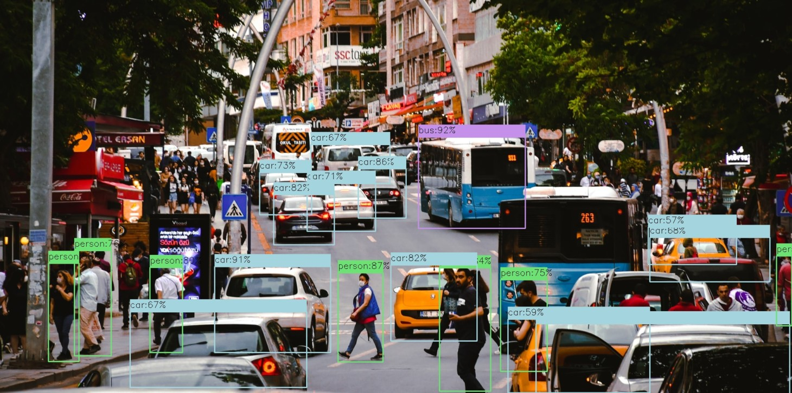

# yolov5_object_detection
***YOLO V5 OBJECT DETECTION APPLICATION***

Our project demonstrate object detection application using the YOLO(You Only Look Once) model version 5 and the Streamlit framework, combined with computer vision techniques using OpenCV.Object detection plays a crucial role in many computer vision applications, allowing us to identify and locate multiple objects within an image or a video stream. The YOLO model version 5 is a state-of-the-art deep learning algorithm known for its high accuracy and real-time performance.With Streamlit, we create an interactive and user-friendly web application that enables users to upload images or provide a video stream for real-time object detection. The Streamlit framework simplifies the development process by providing intuitive widgets and UI components.To process the uploaded images or video stream, we leverage OpenCV, a powerful library for computer vision tasks. OpenCV allows us to perform various image processing operations, such as resizing, color conversions, and pre-processing required for object detection. We integrate the YOLO model version 5 into our application to detect objects accurately.Our application provides a seamless user experience, allowing users to visualize the detected objects, their bounding boxes, and class labels. Additionally, we can leverage Streamlit's capabilities to incorporate additional functionalities, such as filtering detected objects based on confidence scores or displaying statistical insights about the detected objects.By combining the YOLO model version 5, Streamlit, and OpenCV, our project empowers users to perform efficient and accurate object detection tasks in real-time. This application finds applications in various domains, including surveillance, autonomous vehicles, and object recognition systems.
- this app detect objects from images and videos
**our model detect 20 objects from images and videos :**
    - person
    - car
    - chair
    - bottle
    - pottedplant
    - bird
    - dog
    - sofa
    - bicycle
    - horse
    - boat
    - motorbike
    - cat
    - tvmonitor
    - cow
    - sheep
    - aeroplane
    - train
    - diningtable
    - bus
    
***YOLO OBJECT DETECTION FROM IMAGES***

***YOLO OBJECT DETECTION FROM video***

